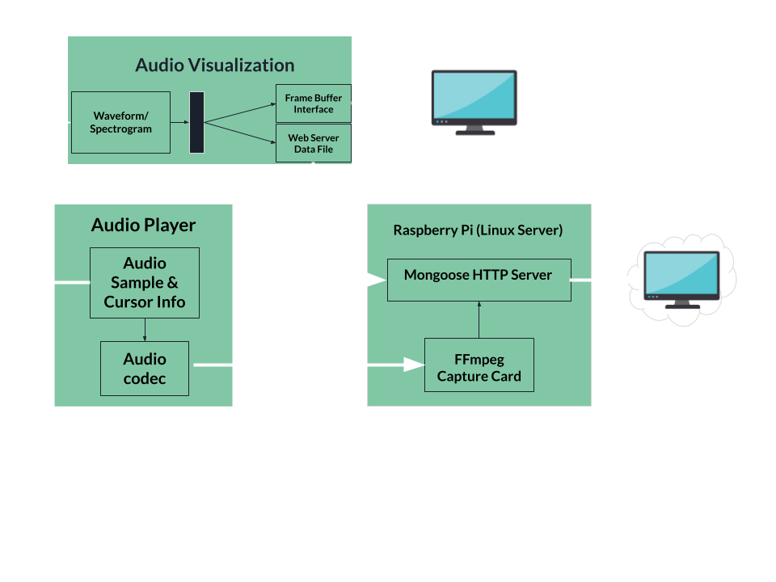

# AudioJAK (Jared, Alexander, Karthik)

## Abstract
The objective of this design was to create an audio visualizer that will be interfaced on a HDMI display and over a web server. Audio operations such as playing a loop, playing a section of the audio file, playing the audio file in reverse, and simple audio editing such as cutting out parts of the audio file were implemented. The audio file’s waveform along with audio file information is displayed in order to better visualize the file. 

## Introduction
AudioJAK is an audio visualizer that streams over a web server. There are many audio visualizers that exist such as Audacity and Adobe Audition but this application was made specifically to enable streaming audio over a web server to allow for remote access to the Zedboard. Currently, there is no way for EECE 4534 students to test the functionality of their audio player code. This project presents a solution for students to listen to the output of the audio codec on the Zedboard remotely. This provides flexibility for students as they don’t have to be in the lab to test their audio player code. 

## Related Work
Used code from Lab 6 as a starting point for the audio player and the previous zedfpgaremote student project as a reference for HLS livestreaming.

## System Diagram

## Top Level Design Overview

The audio display to HDMI works in a top down heirarchy, where all the HDMI diplay features including waveform visualization are done within a seperate thread, and the audio playing features are done in the main loop. This main loop uses exposed functions to draw to the screen.

## Contributions 
Alexander Ingare: [Remote Visualization/Streaming](http-server/HTTP.md)  
Jared Cohen: [HDMI Display](hdmi/HDMI.md)  
Karthik Yalala: [Audio Player](audio_player/PLAYER.md)  

## Implementation Progress
The current version has fully functioning audio playing/editing that is displayed using HDMI. This includes audio operations such as playing a loop, playing a section of the audio file, playing the audio file in reverse, and simple audio editing such as cutting out parts of the audio file. The audio player is also able to get Zedboard information that can be displayed such as the number of users on the board and the IP address. 

The HDMI display plots the waveform and plots the spectrogram if python is installed on the board. It draws and updates cursors on command, and also draws and updates waveforms on command. The HDMI display is refreshed using multiple threads for improved performance. 

## Lessons Learned from Design and Implementation
We learned that it was extremely important to think about integration of components early on in the design process. By planning early on how the integration may work, the actual integration takes less time and debugging. Communication plays a crucial role in this as with good communication, teammates will know exactly what to expect from each others’ components. It is also important to not save integration for later on in the project. Having integration between unfinished components earlier on in the design timeline, helps facilitate conversations as to how to improve individual components for the final implementation. Once a minimal product, with integration of individual components, is made it is much easier to later add features to it. 

## Future Work
A button interface for the audio player to select cursor positioning when cutting the audio file or selecting what section of the audio file to play. Using button interrupts, pause/play and fast forwarding could be implemented. 

For the HDMI diplay, finding a way to plot the spectrogram in C, or cross-compile an executable python scrip to make sure the spectrogram always works would be ideal. It would also be beneficial to increase the refresh rate of the HDMI display to at least 60FPS, which would require a new implementation.
