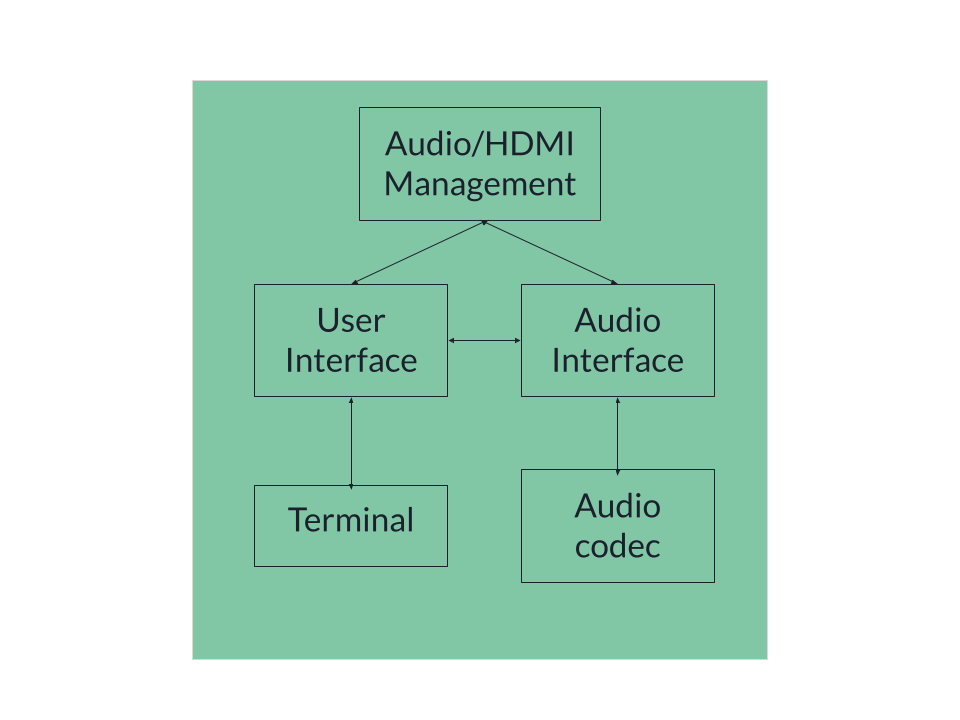

# Audio Player 

## System Diagram 

## player.c:

This file is responsible for the main logic of the audio visualization and player serving as the interface between the audio player and the HDMI display. It updates the HDMI display with audio file information such as left, right, and current cursors and board information such as the IP address of the Zedboard and the number of users on the board. 

The player.c file provides a user interface from which the user can select from the various audio playing and editing options through the main menu and CLI commands. 
The main menu provides users with 5 options: 1. Play audio file, 2. Play audio file in reverse, 3. Cut audio file, 4. Inverse cut audio file, 5. Exit. 

When running the executable, users can add flags to play the audio file without having to go through the main menu. The -p flag plays the audio file within the provided start and end times and loops for the specified number. If the user does not provide values for start, end, or loop the program will use the default values of playing the entire file once. The -r flag plays the entire audio file in reverse. The user can provide the desired loop count, and if they don’t the audio file will play once. The flags can be used as seen below. 

`./player example.wav -p start=0 end=-1 loop=-1` 
`./player example.wav -r loop=-1`

## audio_player.c /audio_player.h file:

These files are responsible for all of the audio playing and editing that can be performed on the Zedboard. This includes playing the audio file within specified cursors, playing the entire audio file in reverse, looping through the audio file for a finite or infinite number of times, pause and play functionality, and cutting out a portion of the audio file. They are also responsible for getting simple Zedboard information such as the IP address and the number of users on the board. 

## Experimental Results

When running the player.c file, it was observed that the CPU utilization was 150%. This is a direct result of the multithreaded design of the HDMI visualization. Without the HDMI display code being used in the player.c file, the CPU utilization was around 4%.

