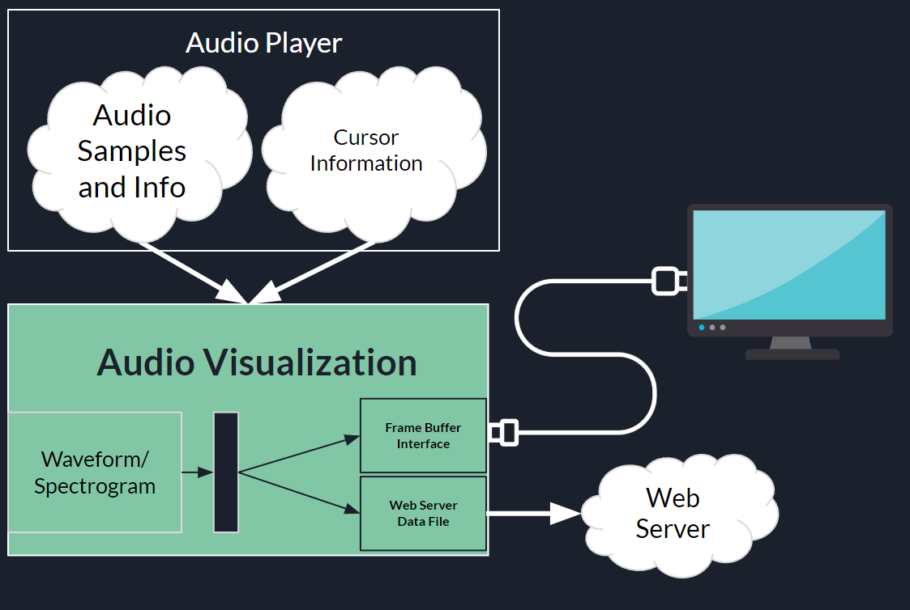
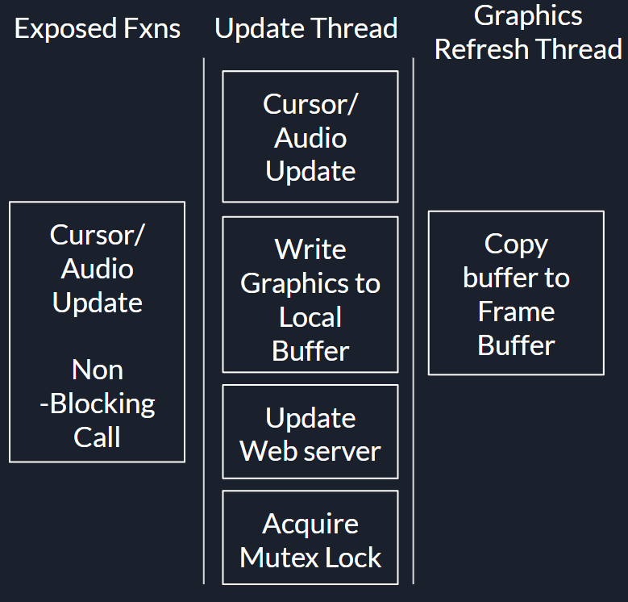
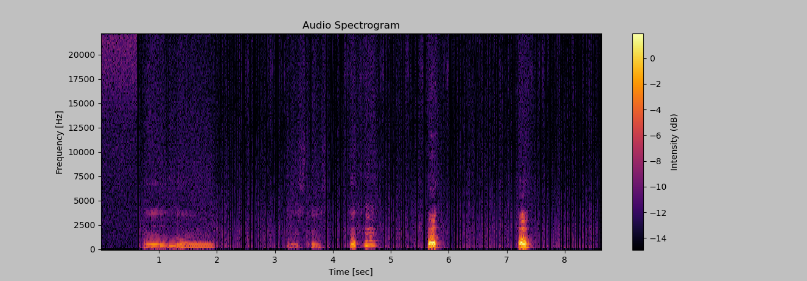
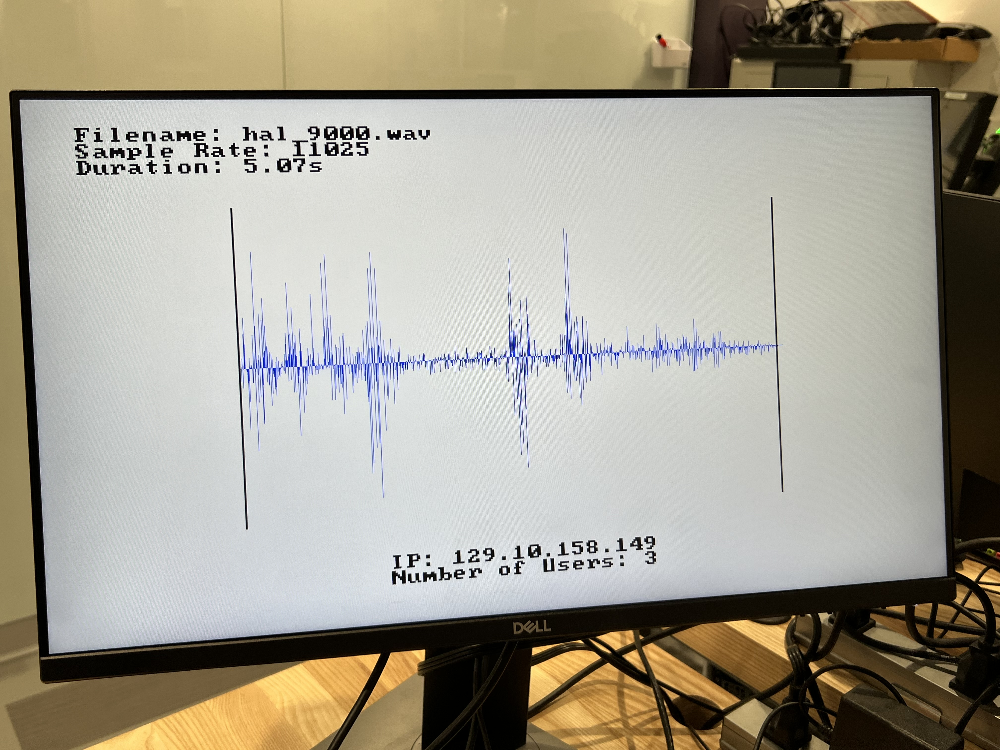
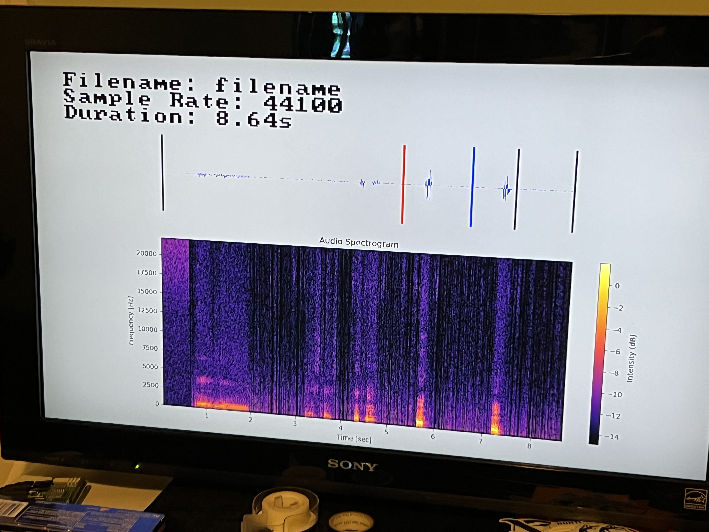

# HDMI Interface and Audio Visualization

## System Diagram

- Audio Player:
    - Feeds in audio samples and file information
    - Gives cursor information when an update is necessary
    - All of the functions exposed to the audio player are high-level and non-blocking, so the audio playing can be done without any delay.

- Audio Visualization:
    - Takes the waveform and performs the following operations:
        - Plots the waveform
        - Plots the spectrogram (Note: It checks for python installation and will not show if python can't load)
    - Draws and updates cursors on command
    - Draws and updates waveforms on command
    - Contains an HDMI "class" which constantly refreshes the screen in a non-blocking way
        - Outputs the screen to both HDMI and to the web server through a file interface

## Threading Diagram

These are the three threads and their functionality. The graphics refresh thread is purely responsible for reloading the frame buffer as often as possible. The update thread is used to update all of the graphics in a non blocking way so that long computations (such as updating a waveform) do not stop audio playing or degrade performance. The "exposed functions" thread is the main thread functions availible that are non-blocking.

## Spectrogram Output

Here is a sample spectrogram output:

This shows inside the HDMI output when Python is present and has all the availible modules. Unfortunately, it is near impossible to install modules on the Zedboard so this feature is disabled during runtime. 

It is created by calling a python script to generate a spectrogram using scipy and matplotlib.

## Output Example:

This is what the output looks like without python installed:

This is what the output looks like with python installed:

